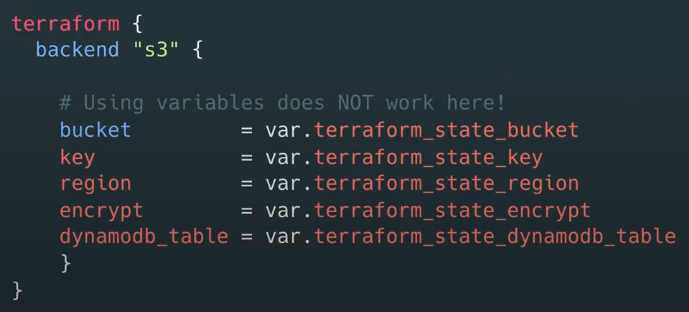

## Features
1. `path_relative_to_include()` :: Maintain efficient backend configurations by letting us define them just one in a root location and then inheriting that config in all child modules.

**Problem:**
- Backend configuration doesn't support variables or expressions, we need to copy and paste it, updating the parameters as needed
- Even using local state, we must update the path to the state file
    - dev/vpc/state
    - stating/vpc/state
- If we using bucket, we alse need to update the bucket name for each env 

2. `generate` :: Refactor common Terraform code 

**Problem:**
- Managing provider config across all your modules can be challenging, particularly when customizing authentication credentials.
- If we need to update provider, we must do so in each environment separately